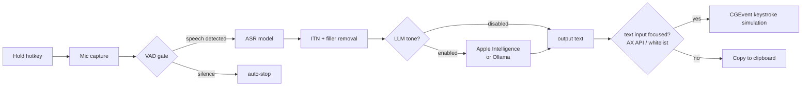

  

  # VoxNotch

  **Dictate into any macOS app using your MacBook's notch.**

  On-device transcription. No cloud. No subscription.

  [Download](#installation) · [Build from source](#building-from-source) · [License](#license)

---

VoxNotch is a macOS menu bar dictation app that uses the MacBook notch as its recording UI. Audio is transcribed locally using Apple Silicon–optimised ASR models (FluidAudio, MLX); nothing leaves the device.

There are other Whisper-based dictation tools, but VoxNotch is built specifically around the notch and around models optimised for Apple Silicon — lower latency, lower memory use, and no dependency on a Python runtime or server process.

## How it works

Hold ⌃⌥ (Control + Option) to start recording. A waveform appears in the notch area while the microphone is active. Release the hotkey to stop; the audio is passed to the selected ASR model and the transcript is delivered to the current application.

Output targets the application and, when Accessibility exposes them, the window and input field focused when recording begins. If the target changes, VoxNotch copies the transcript and shows a clipboard notice. Otherwise it inserts via simulated keystrokes or clipboard paste. Optional clipboard restoration preserves all item types and does not overwrite a newer copy.

Qwen receives the selected language explicitly; Auto leaves the language prompt open and parses the model's detected language. Optional VAD rejects recordings without speech for both ASR engines. ITN, filler removal, and optional local LLM processing run before output.

Voxtral starts processing finalized audio segments during recording. It prefers pauses after three seconds and limits each segment to twelve seconds; stopping flushes the remainder. This uses independent segment inference, not a continuous decoder cache. Long uninterrupted speech may lose context at segment boundaries. The complete WAV remains available for fallback if streaming fails.

## Installation

### Download

Grab the latest `.dmg` from the [Releases page](https://github.com/owenffff/VoxNotch/releases):

1. Open the `.dmg` and drag **VoxNotch.app** to your Applications folder
2. Launch VoxNotch — macOS will ask for **Accessibility** and **Microphone** permissions on first run
3. The VoxNotch icon appears in the menu bar — hold ⌃⌥ to start recording

Requires macOS 15 Sequoia or later on Apple Silicon.

### Building from source

1. Clone the repo
2. Open `VoxNotch.xcodeproj` in Xcode 26+
3. Set a development team in Signing & Capabilities
4. Build and run the `VoxNotch` scheme (⌘R)

The project uses Swift 6 strict concurrency. Package dependencies (MLX, FluidAudio) are fetched automatically on first build.

## Models

Model weights are downloaded on first use from Hugging Face. After that, transcription works offline.

| Model | Engine | Size | Languages | Notes |
|---|---|---|---|---|
| Parakeet v2 | FluidAudio | ~500 MB | English | Default; lowest latency |
| GLM-ASR Nano | MLX Audio | ~400 MB | Multilingual | Lowest memory use |
| Qwen3-ASR 0.6B (4-bit) | MLX Audio | ~713 MB | Multilingual | Compact Qwen option |
| Qwen3-ASR 1.7B (4-bit) | MLX Audio | ~1.61 GB | Multilingual | Smaller download than BF16 |
| Qwen3-ASR 1.7B (BF16) | MLX Audio | ~3.4 GB | Multilingual | Original full-precision option |
| Voxtral Mini 4B Realtime (4-bit) | MLX Audio | ~3.13 GB | 13 languages | Processes speech segments while recording |
| Custom | MLX Audio | varies | varies | Supported GLM-ASR, Qwen3-ASR, or Voxtral Realtime MLX checkpoints |

The Qwen variants have separate downloads and caches. Existing Qwen3-ASR settings continue to select BF16. Sizes describe downloads, not peak runtime memory; quantized accuracy and latency should be evaluated on your own recordings.

While the hotkey is held, left/right arrow keys cycle through models without opening Settings. Models are released after five minutes of inactivity or idle memory pressure; active recordings and inference keep their models alive.

See [local evaluation instructions](docs/asr-evaluation.md) and [implementation notes](docs/asr-optimizations.md).

## Post-processing

Off by default. When enabled, the raw transcript is passed to a local LLM before output. Supported backends: Apple Intelligence (macOS 26+) and Ollama running on localhost.

Built-in prompt presets:

| Preset | What it does |
|---|---|
| Formal Style | Rewrites for professional writing; removes contractions |
| Technical Writing | Formats for technical docs; puts code references in backticks |
| Concise | Removes repetition and filler, preserves meaning |
| Email | Adds greeting and closing; organises into paragraphs |
| Fix Grammar | Corrects grammar and punctuation only; does not alter style |
| Custom | Arbitrary system prompt |

While the hotkey is held, up/down arrow keys cycle through tone presets.

When post-processing is off, ITN and filler word removal still run on-device.

## Hotkeys

| Action | Default |
|---|---|
| Start recording | Hold ⌃⌥ |
| Stop recording | Release ⌃⌥ |
| Cancel recording | Esc (optional, off by default) |
| Cycle model | ⌃⌥ + ← / → |
| Cycle tone | ⌃⌥ + ↑ / ↓ |

The modifier combination is configurable in Settings.

## Limitations

- **Intel Macs are untested.** Apple Silicon is required for the bundled ASR models; Intel support is not a goal.
- **The notch UI requires a Mac with a notch** (MacBook Pro 2021+, MacBook Air M2+). Recording works on any Mac, but there will be no waveform in the notch area.
- **LLM post-processing has hardware requirements.** Apple Intelligence requires macOS 26+ on a supported Apple Silicon device. Ollama requires a separately installed and running local instance.
- **Custom models must be in MLX format.** Non-MLX models (e.g. GGUF, CoreML) are not supported.

## Data and privacy

- Recordings use temporary WAV files, removed after successful processing or cancellation. Failed recordings may be retained for retry. Optional saved recordings are stored locally alongside history.
- Transcripts are stored in a local SQLite database at `~/Library/Application Support/VoxNotch/`; history can be cleared or disabled
- No telemetry or analytics
- Built-in model configuration and weight downloads use Hugging Face. Arbitrary Hugging Face imports are currently unavailable in the UI; existing imports remain manageable. Transcription runs locally; optional Ollama processing uses the configured endpoint.

## Requirements

- macOS 15 Sequoia or later
- Apple Silicon (Intel untested)
- Accessibility permission (required for typing into other apps)
- Microphone permission
- Disk space: ~500 MB for the default model; up to ~3.4 GB more for Qwen3-ASR

LLM post-processing additionally requires Apple Intelligence (macOS 26+, supported hardware) or a local Ollama instance.

## Development and releases

PRs and pushes to `main` run automated tests. Tagged releases run those checks before creating a DMG and SHA-256 checksum. See [release instructions](docs/releasing.md) and [changelog](CHANGELOG.md).

## License

VoxNotch is free software released under the [GNU General Public License v3.0](LICENSE).
